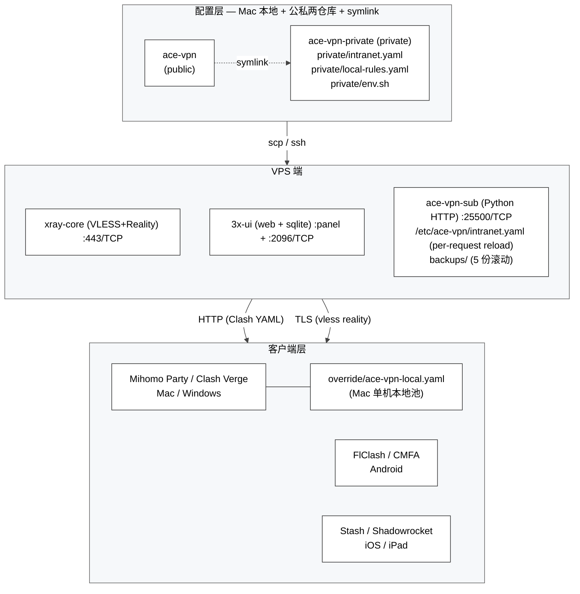
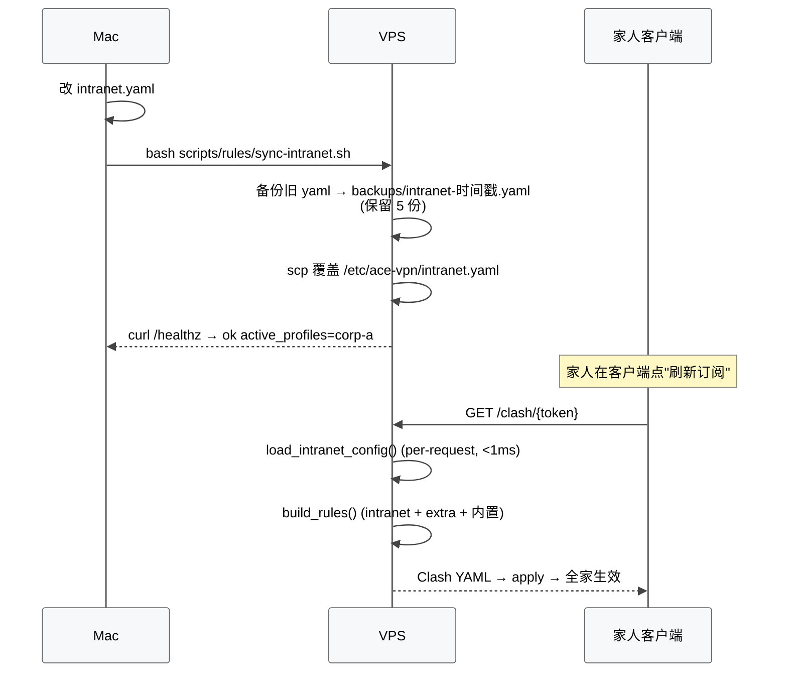
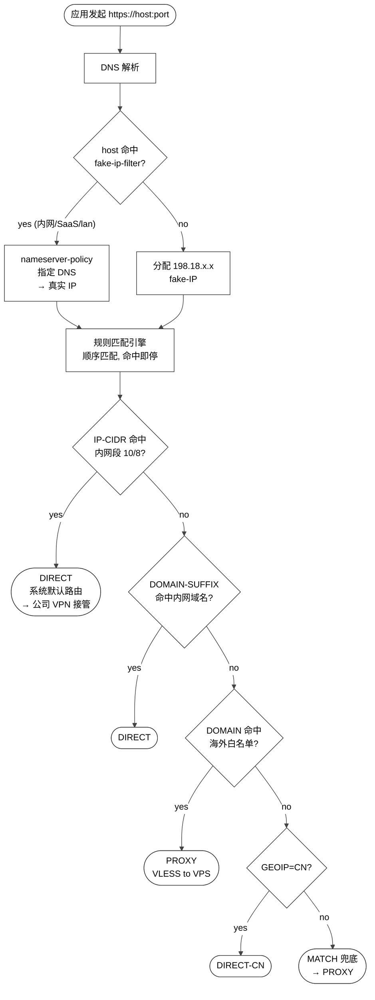
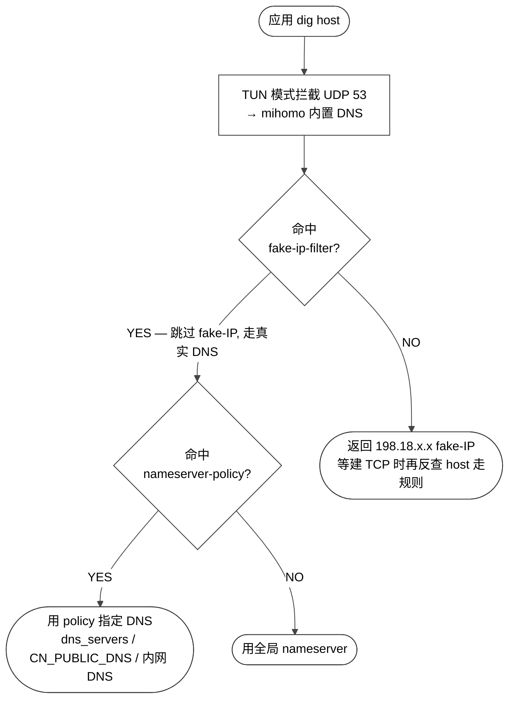
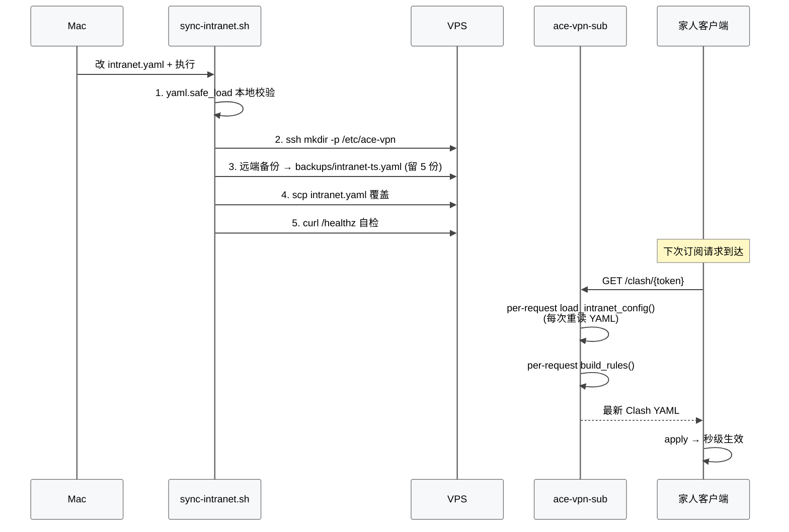

# ACE 架构设计

> 本文是 [ace-vpn](https://github.com/xiaonancs/ace-vpn) 项目从 0 到 1 的完整系统设计。覆盖 VPS 端 / 客户端 / 配置层 / 同步层四块，回答"为什么这么搭"以及"怎么改一次让全家都生效"。
>
> 文中所有真实公司域名 / 真实 IP / 真实 DNS 均已脱敏，统一用 `corp-a.example` / `10.x.x.x` 占位。
>
> 事件型文档（每周做了什么 / 学到什么 / 踩了什么坑）请看 [开发者日志](./开发者日志.md)；本文专注"系统怎么搭起来 / 怎么用"。

---

## 目录

1. [设计目标 & 三大约束](#1-设计目标--三大约束)
2. [系统全景](#2-系统全景)
3. [VPS 一键部署](#3-vps-一键部署)
4. [VPS 选型：Vultr vs HostHatch](#4-vps-选型vultr-vs-hosthatch)
5. [sub-converter 多 token 架构](#5-sub-converter-多-token-架构)
6. [三网段流量分流](#6-三网段流量分流)
7. [DNS 设计](#7-dns-设计)
8. [规则系统：更新 / 同步 / 冲突](#8-规则系统更新--同步--冲突)
9. [多设备 / 多云端同步](#9-多设备--多云端同步)
10. [客户端分发策略](#10-客户端分发策略)
11. [内网配置的热加载机制](#11-内网配置的热加载机制)
12. [关键踩坑速查](#12-关键踩坑速查)
13. [诊断工具集](#13-诊断工具集)
14. [未来优化方向](#14-未来优化方向)

---

## 1. 设计目标 & 三大约束

### 1.1 场景

- 在一线城市工作的技术人，2–5 人家庭共用。
- 每天要用 Claude / ChatGPT / Cursor / YouTube，这些在大陆被墙或被限速。
- 同时在公司上班，公司有自己的内网 VPN（类似 GlobalProtect / 某 Link / 公司 Zero Trust 网关），登录后会下发一批 `10.x.x.x` 内网段和一个内网 DNS。
- 希望**一套客户端同时管这三件事**：访问海外的走代理、访问国内公网的直连、访问公司内网的走公司 VPN 出口（DIRECT，让系统路由表 + 公司 VPN 工具自己负责）。

### 1.2 反例：不做分流会怎样

| 策略 | 后果 |
|------|------|
| 全部走代理 | B 站 / 淘宝 / 公司内网全炸，延迟翻倍，还容易触发风控 |
| 全部直连 | Claude / YouTube 不通 |
| 按需手动开关代理 | 工作效率杀手，一天切几十次；家人根本不会用 |
| 公司 VPN + 代理软件二选一 | 二者排他，切换时所有长连接断开 |

### 1.3 三大硬指标 + 一条心智约束

| 维度 | 目标 |
|------|------|
| AI 工具（Claude / ChatGPT / Cursor） | 100% 海外 IP |
| 大陆公网（B 站 / 抖音 / 淘宝） | 100% 直连，不绕圈 |
| 公司内网（`app.corp-a.example` / `10.x`） | 100% DIRECT，不被代理接管 |
| 切换成本 | 0。同一份订阅，客户端不需动任何设置 |
| 跨公司切换 | 换公司只改一个 YAML 文件，家人端自动同步 |
| **零运维** | 半年内不动任何 systemctl，改一处全家 10 秒生效 |

### 1.4 三大约束

1. **半年内零运维**——任何"加一条规则要 ssh + restart"的方案都不可接受
2. **服务端集中管控 + 客户端单一订阅 URL**——家人不会改 YAML，只能"刷新订阅"
3. **隐私数据集中**——公司内网域名 / 入口 IP 不能写进客户端规则集（手机丢了全泄漏）

---

## 2. 系统全景

### 2.1 三层架构

<div style="background: #ffffff !important; background-color: #ffffff !important; border: 1px solid #d0d7de; border-radius: 8px; padding: 16px; margin: 16px 0; overflow-x: auto;" bgcolor="#ffffff">



</div>

### 2.2 组件分工

| 组件 | 角色 |
|------|------|
| **xray-core** | 在 VPS 上终结 Reality 连接、把流量转到海外公网 |
| **3x-ui** | 管理面板；维护 Client（UUID / Flow / Email）和 SubToken，状态全在 `/etc/x-ui/x-ui.db` 一张 SQLite |
| **sub-converter.py** | 自研 Python（~600 行），把 3x-ui 的 base64 `vless://` 订阅转成带分流规则的 Clash Meta YAML；内嵌规则引擎 + `/match` 调试接口 + `/healthz` |
| **intranet.yaml** | 多 profile 内网分流配置；本地真值在 `ace-vpn-private/intranet.yaml`，VPS 端是 `/etc/ace-vpn/intranet.yaml` 的副本 |
| **local-rules.yaml** | Mac 本地规则池（git 跟踪在 `ace-vpn-private`），渲染成 Mihomo Party 的 override，秒级单机生效；`promote-to-vps.sh` 推 VPS 后清空 |
| **Clash 客户端** | 消费 Clash YAML，负责 DNS + 规则匹配 + 代理出口；TUN 模式接管全表 |

### 2.3 数据流时序

<div style="background: #ffffff !important; background-color: #ffffff !important; border: 1px solid #d0d7de; border-radius: 8px; padding: 16px; margin: 16px 0; overflow-x: auto;" bgcolor="#ffffff">



</div>

### 2.4 端口约定

| 端口 | 协议 | 服务 | 是否公网可达 |
|------|------|------|-------------|
| 22 | TCP | SSH | 是（仅 key） |
| 443 | TCP | VLESS Reality | 是 |
| 2096 | TCP | 3x-ui 订阅 | 是（HTTPS） |
| 25500 | TCP | sub-converter | 是（HTTP，YAML 已脱敏） |
| `<random>` | TCP | 3x-ui 面板 | 是（随机端口 + 随机 path + HTTPS） |
| 8443 | UDP | Hy2（预留） | 否（未启用） |

---

## 3. VPS 一键部署

### 3.1 完整 5 行命令

```bash
# 1. SSH 登录新 VPS
ssh root@<VPS_IP>

# 2. 克隆仓库
git clone https://github.com/<you>/ace-vpn.git && cd ace-vpn

# 3. 一键：系统 + 防火墙 + 3x-ui + 自动建 Reality 入站
sudo AUTO_CONFIGURE=1 bash scripts/deploy/install.sh

# 4. 浏览器登面板改密码 + 改 path + 改端口
#    https://<VPS_IP>:2053/<random-path>/

# 5. 装 Clash 订阅转换器（多 token 单实例）
sudo UPSTREAM_BASE='https://<VPS_IP>:2096/<sub_path>' \
     SUB_TOKENS='sub-hxn,sub-hxn01' \
     SERVER_OVERRIDE='<VPS_IP>' \
     LISTEN_PORT=25500 \
     bash scripts/deploy/install-sub-converter.sh
```

### 3.2 install.sh 干了啥

| 阶段 | 脚本 | 动作 |
|------|------|------|
| 系统初始化 | `setup-system.sh` | apt update、BBR + fq、`net.ipv4.ip_forward=1`、文件句柄上限 |
| 防火墙 | `setup-firewall.sh` | UFW 放行 22/80/443/2096/25500/面板端口 |
| 3x-ui | `install-3xui.sh` | 官方安装器包装；交互点：端口 2053、admin/admin、SSL 选 2（IP 证书）|
| 自动配 Reality | `configure-3xui.sh`（`AUTO_CONFIGURE=1`）| 调 3x-ui HTTP API 建 VLESS+Reality 入站，SNI=www.cloudflare.com，flow=xtls-rprx-vision |

### 3.3 面板加固（必做）

浏览器打开 `https://<VPS_IP>:2053/<生成的随机 path>/` → 登录 → **Panel Settings**：

- 端口：2053 → 随机 5 位（如 41785）
- Path：改成随机 16 位（前后带 /）
- 用户名/密码：admin/admin → 强随机

改完立刻：

```bash
sudo ufw allow 41785/tcp
sudo ufw delete allow 2053/tcp
sudo ufw reload
```

**Subscription Settings**：Enable = ON，Port = 2096，Path = `/sub_<随机>/`、JSON Path = `/json_<随机>/`，Domain 留空（用 IP）。

`configure-3xui.sh` 会在 `/root/ace-vpn-credentials.txt` 生成所有凭据（Panel URL / UUID / pbk / sid / 订阅 URL）。**跑完立刻 scp 到本地 `private/`，然后 VPS 上 `shred -u` 删掉**。

---

## 4. VPS 选型：Vultr vs HostHatch

### 4.1 横向对比（2026-04）

| 维度 | Vultr Tokyo | HostHatch Tokyo | 结论 |
|------|-------------|-----------------|------|
| 价格 | $6/月 ≈ ¥520/年 | $4/月 ≈ ¥345/年 | HostHatch 便宜 ¥175/年 |
| CPU | 1 vCPU（shared）| 1 AMD EPYC Milan core（fair share）| HostHatch 快 30-50% |
| RAM | 1 GB | 2 GB | HostHatch 胜 |
| 磁盘 | 25 GB SSD | 10 GB **NVMe** | Vultr 大，HostHatch 快 |
| 带宽 | 2 TB/月 | 1 TB/月 | Vultr 大，但家用单人 1TB 够 |
| 月付 | ✅ | ✅（也有年付） | 一致 |
| 退款 | ❌ | 3-7 天 | HostHatch 胜 |
| 注册风控 | 几乎无 | **下单时不能挂代理**（IP 国家 vs 账单地址不一致会被 flag） | Vultr 更省事 |
| 付款 | 信用卡/PayPal/Alipay | 信用卡/PayPal | 一致 |
| 延时（北京）| ~80ms | ~50ms | HostHatch 胜 |

### 4.2 决策

**首选 HostHatch，Vultr 做短期验证 + 冷备**。

- 需求排序：**低延时（AI / 日常）> 晚高峰稳定（家人 4K）> 价格**
- HostHatch 延时 ~50ms、NVMe、AMD EPYC，单人 4K 够用
- Vultr 保留 1 个月冷备（额外 ¥44），确认稳定后 destroy

### 4.3 下单坑

#### Vultr
- 账号 email 用正规域名（gmail/outlook）
- 月付即可，随时停

#### HostHatch
- **下单时必须关所有代理**，用真实中国 IP 直连网站填表。IP 国家 vs 账单国家不一致会被反欺诈系统 flag
- 账单地址填**真实中国地址**，Country 选 China。不要伪装海外身份
- SSH Key 字段订单页就有位置，直接贴 `cat ~/.ssh/id_ed25519.pub`，省掉临时密码再 `ssh-copy-id` 的过程
- IPv6 免费就勾上，**不要加钱**的 Additional IPv4
- Hostname 填中性的（例 `vpn-tyo`），不要 `xray` / `vpn-proxy` 这类关键词

---

## 5. sub-converter 多 token 架构

### 5.1 为什么不直接用 3x-ui 的原生订阅

- 3x-ui 输出 `vless://` base64 列表，**没有分流规则**
- Shadowrocket 能吃但得自己写规则；Mihomo / Clash 需要 YAML 格式
- 社区的 `tindy2013/subconverter` 等 fork **不认 Reality 的 `pbk` / `sid` / `spx`** 参数

→ 自研 `scripts/server/sub-converter.py`（~600 行 Python），原生支持 Reality + 规则硬编码 + intranet 热加载 + `extra.{cn,overseas}` prepend + `/match` 调试 + `/healthz`。

### 5.2 多 token 单实例

早期设计是"每家人一个 sub-converter 实例"，后来演进为：**一个实例、多 token 白名单、token 对应 3x-ui 里的 SubId**。

```
┌──────────────────────────────────────────────────┐
│ ace-vpn-sub systemd service                     │
│                                                  │
│ Environment:                                     │
│   UPSTREAM_BASE=https://127.0.0.1:2096/<path>    │
│   SUB_TOKENS=sub-hxn,sub-hxn01                   │
│   SERVER_OVERRIDE=<VPS_IP>                       │
│   LISTEN_PORT=25500                              │
│                                                  │
│ do_GET(/clash/<token>):                          │
│   1. 校验 token 在 SUB_TOKENS 白名单             │
│   2. 拉 UPSTREAM_BASE/<token>（3x-ui base64）   │
│   3. 解析 vless://... 生成 Clash proxies         │
│   4. 覆盖 server 字段为 SERVER_OVERRIDE          │
│   5. load_intranet_config() + build_rules()      │
│   6. 拼装 dns + rule-providers + rules → YAML    │
└──────────────────────────────────────────────────┘
```

| Token | 对应 3x-ui SubId | 服务对象 |
|-------|-----------------|----------|
| `sub-hxn` | `sub-hxn` | 你自己的所有设备（Mac×2 / iPhone / iPad / Android）|
| `sub-hxn01` | `sub-hxn01` | 家人所有设备（Windows×2 / ...） |

加人只需：(1) 面板里加 Client，挂到对应 SubId；(2) 如需新 SubId，加到 `SUB_TOKENS` 环境变量；(3) `systemctl restart ace-vpn-sub`。

### 5.3 关键环境变量

| 变量 | 作用 | 典型值 |
|------|------|--------|
| `UPSTREAM_BASE` | 3x-ui 订阅 URL 前缀 | `https://127.0.0.1:2096/sub_xxxxx` |
| `SUB_TOKENS` | 白名单，逗号分隔 | `sub-hxn,sub-hxn01` |
| `SERVER_OVERRIDE` | 覆盖 YAML 里 `server:` 字段 | `<VPS_IP>` |
| `LISTEN_PORT` | 监听端口 | `25500` |
| `COMPANY_CIDRS` | 公司内网 CIDR（向后兼容旧部署）| `10.128.0.0/16` |
| `COMPANY_SFX` | 公司域名后缀（向后兼容旧部署）| `corp.example.com` |

### 5.4 改了环境变量后必须显式 restart

旧版 install 脚本只做 `systemctl enable --now`，对已运行的服务**不触发重启**。daemon-reload 只加载新 unit 文件，旧进程仍在用老环境。

现在 `install-sub-converter.sh` 最后会显式 `systemctl restart ace-vpn-sub`，并自检每条 token 的节点数 —— 如果某条返回 0，脚本会直接报错。

---

## 6. 三网段流量分流

### 6.1 三网段模型

把所有流量抽象成三张网：

| 编号 | 名字 | 例子 | 出口策略 |
|:-:|------|------|----------|
| ① | **Net-Overseas**（海外公网） | `claude.ai`, `youtube.com`, `chatgpt.com` | 走 VPS 上的 VLESS+Reality 代理 |
| ② | **Net-CN**（大陆公网） | `taobao.com`, `bilibili.com`, `baidu.com` | 本地直连（不走代理，不走公司 VPN） |
| ③ | **Net-Intranet**（公司内网） | `app.corp-a.example`, `10.0.0.0/8` | DIRECT，交给公司 VPN 工具处理 |

核心设计抉择：**三张网用同一份 Clash YAML 订阅来表达**，客户端只装一个代理软件、只订一次。

```
     ┌─ ① Net-Overseas ─→ proxy group "Overseas"  → VLESS+Reality to VPS
     │
请求 ├─ ② Net-CN       ─→ proxy group "Direct-CN" → 本机出口（系统默认路由）
     │
     └─ ③ Net-Intranet ─→ proxy group "Direct-LAN" → DIRECT，公司 VPN 接管
```

②③ 同样走 DIRECT，但逻辑分组不同，诊断和统计时一眼看清"这条流量是内网走的还是大陆公网走的"。

### 6.2 三大技术挑战

#### 挑战 A：出境流量如何不被 GFW 阻断

普通 V2Ray/Trojan 早被识别；自签 TLS 证书会被主动探测封端口。

**解决**：VLESS + Reality。Reality 的做法是"偷"一个第三方 HTTPS 站点的 TLS 证书握手，让 GFW 的中间人探测结果和正常访问那个站点完全一致，无法区分。代价是要在 VPS 端挑一个稳定、海外热门的"偷用"目标。

#### 挑战 B：客户端如何智能识别目的地

三种信号源同时消费：

1. **域名后缀**：`+.youtube.com` → ①；`+.taobao.com` → ②；`+.corp-a.example` → ③
2. **IP 段**：`10.0.0.0/8` → ③；`GEOIP,CN` → ②；其余 → ①
3. **GFW 实测**：某些域名不在常规黑名单但实际被限速，需要手工补进 ①

#### 挑战 C：DNS 是最难搞的一环

详见 §7 DNS 设计。

#### 挑战 D：客户端软件自己也会捣乱

Clash Party / Mihomo Party 默认 `controlDns: true`，会把订阅的 `dns:` 段**整段替换**——服务端再怎么精心生成 `fake-ip-filter` / `nameserver-policy` 都会被静默丢弃。详见 [开发者日志 §4.A.1](./开发者日志.md#4a1-2026-04-19-mihomo-party-吞掉订阅的-dns-段-)。

### 6.3 分流决策流程

<div style="background: #ffffff !important; background-color: #ffffff !important; border: 1px solid #d0d7de; border-radius: 8px; padding: 16px; margin: 16px 0; overflow-x: auto;" bgcolor="#ffffff">



</div>

两点需要强调：

**(A)** DNS 是规则匹配的**前置步骤**。Clash 先完成 DNS 解析，再用解析结果进规则引擎。`IP-CIDR` 匹配要靠真实 IP，如果 DNS 这一步返回的是 fake-IP（`198.18.x.x`），`IP-CIDR,10.0.0.0/8` 这类规则就永远不会命中——这是内网场景里最坑的一个点。

**(B)** 规则顺序很重要。把 `IP-CIDR` 内网规则放最前，是因为某些公司内网域名同时也在公网有 DNS 记录（"混合域"），只靠 `DOMAIN-SUFFIX` 会误判。走 IP 判断更稳。

### 6.4 规则集与优先级

最终生成的 Clash `rules:` 段大致长这样（从上到下匹配，命中即停）：

```yaml
rules:
  # ─────────── Priority 1: 公司内网 IP 段
  - IP-CIDR,10.0.0.0/8,Direct-LAN,no-resolve
  - IP-CIDR,172.16.0.0/12,Direct-LAN,no-resolve
  - IP-CIDR,192.168.0.0/16,Direct-LAN,no-resolve

  # ─────────── Priority 2: 公司内网域名 (intranet.yaml profiles.<>.domains)
  - DOMAIN-SUFFIX,app.corp-a.example,Direct-LAN
  - DOMAIN-SUFFIX,office.corp-a.example,Direct-LAN
  # 多公司并存时按 profile 堆
  - DOMAIN-SUFFIX,portal.corp-b.example,Direct-LAN

  # ─────────── Priority 3: 用户自定义 prepend (extra.overseas / extra.cn)
  # 用户手加规则永远赢内置默认（修正误判 / 接管新服务）
  - DOMAIN-SUFFIX,<saas>.example,DIRECT       # extra.cn
  - DOMAIN-SUFFIX,<new-ai>.example,Overseas    # extra.overseas

  # ─────────── Priority 4: 内置 - 走代理（GFW 封 or 实测限速）
  - DOMAIN-SUFFIX,claude.ai,Overseas
  - DOMAIN-SUFFIX,openai.com,Overseas
  - DOMAIN-SUFFIX,youtube.com,Overseas
  # ... ~200 条 GFW 相关域名 ...

  # ─────────── Priority 5: 内置 - 直连国内服务
  - DOMAIN-SUFFIX,bilibili.com,Direct-CN
  - DOMAIN-SUFFIX,taobao.com,Direct-CN
  # ... ~100 条常用国内大厂域名 ...

  # ─────────── Priority 6: GeoIP 兜底
  - GEOIP,CN,Direct-CN,no-resolve
  - GEOIP,LAN,Direct-LAN,no-resolve

  # ─────────── Priority 7: MATCH 兜底 → 走代理
  - MATCH,Overseas
```

要点：

1. **`no-resolve`** 很重要。对 IP-CIDR 规则带上它，告诉 Clash 不要再做反向 DNS，直接用请求里的 IP 判断。
2. **IP 规则先于域名规则**，因为"混合域"（同时有公网 CNAME 和内网 CNAME 的域）只靠域名判断会走错。
3. **MATCH 兜底走代理**，不是走直连——未知流量按"可能是海外服务"处理，防止奇怪的第三方 API 用了非常规域名被漏判。
4. **用户自定义 `extra` prepend 在内置规则之前**，所以用户手加的规则永远能覆盖内置默认。

---

## 7. DNS 设计

> ⭐ 本周（2026-04-24）刚做的最大重构。DNS 是整个 ACE 架构里最容易翻车的一环，专章详细讲。

### 7.1 DNS 解析路径全景

<div style="background: #ffffff !important; background-color: #ffffff !important; border: 1px solid #d0d7de; border-radius: 8px; padding: 16px; margin: 16px 0; overflow-x: auto;" bgcolor="#ffffff">



</div>

### 7.2 域名分类决定 DNS 策略

[开发者日志 §4.A.6](./开发者日志.md#4a6-2026-04-24-把零信任--saas-公网域名误当成真内网域名-) 总结的 A/B/C 三类：

| 类型 | 公网 DNS | 入口 | 应放在 | DNS 策略 |
|---|---|---|---|---|
| A. 真·内网（`<srv>.intranet`）| 解不到 | 10/8 | `profiles.<>.domains` | 公司内网 DNS（10.x） |
| B. SaaS（`<saas-app>.example`）| 公网真实 IP | 公网 | `extra.cn` | **`CN_PUBLIC_DNS`** = `[119.29.29.29, 223.5.5.5]` |
| C. 零信任网关（`<sso>.<corp-office>.example`）| 公网网关 IP | 公网网关 | `extra.cn` | **`CN_PUBLIC_DNS`** |

`sub-converter.py` 拿到 `intranet.yaml` 之后自动渲染：

```yaml
dns:
  enable: true
  enhanced-mode: fake-ip
  fake-ip-range: 198.18.0.1/16

  fake-ip-filter:
    - "*.lan"
    - "*.local"
    - +.msftconnecttest.com
    # ── A 类：真·内网（profiles.<>.domains）
    - +.app.corp-a.example
    - +.office.corp-a.example
    - +.corp-a.srv
    # ── B/C 类：SaaS / 零信任 (extra.cn)
    - +.<saas>.example
    - +.<sso>.<corp-office>.example
    - +.<biz-app>.<corp-app>.example

  nameserver-policy:
    # A 类用公司内网 DNS
    +.app.corp-a.example: [10.x.x.1, 10.x.x.2]
    +.office.corp-a.example: [10.x.x.1, 10.x.x.2]
    +.corp-a.srv: [10.x.x.1, 10.x.x.2]
    # B/C 类强制国内 UDP 公网 DNS（CN_PUBLIC_DNS）
    +.<saas>.example: [119.29.29.29, 223.5.5.5]
    +.<sso>.<corp-office>.example: [119.29.29.29, 223.5.5.5]

  nameserver:
    - https://doh.pub/dns-query
    - https://dns.alidns.com/dns-query

  fallback:
    - https://dns.cloudflare.com/dns-query
    - https://dns.google/dns-query

  fallback-filter:
    geoip: true
    geoip-code: CN
```

### 7.3 三组 DNS 服务器并存

| 用途 | 上游 | 作用 |
|------|------|------|
| 解海外域名 | `dns.cloudflare.com` / `dns.google`（DoH） | 绕 GFW DNS 污染 |
| 解国内公网域名 | `doh.pub`（腾讯） / `dns.alidns.com`（阿里）（DoH） | CDN 归属准确 |
| 解 B/C 类（SaaS / 零信任）| `119.29.29.29` / `223.5.5.5`（**UDP 53**）| **避免 DoH 经海外 PROXY 的副作用** |
| 解公司内网域名 | 公司 VPN 下发的 `10.x.x.x` DNS | 唯一能解内网 |

### 7.4 fake-IP 与 fake-ip-filter

**fake-IP** 是 Clash 的核心机制：收到应用 DNS 查询时，不立即做真实解析，而是返回一个临时的 `198.18.x.x` 假 IP；等应用实际建 TCP 连接时，Clash 用最初的 host name 查规则、选代理、再做真实解析（如果需要）。好处：DNS 层不被污染 + 规则引擎能拿到原始 host。

但 fake-IP 对内网致命：

1. `dig app.corp-a.example` 返回 `198.18.0.42`
2. 应用 `connect(198.18.0.42:443)`
3. Clash 看 `198.18.0.42`，反查 fake-ip cache 得到原始 host
4. 匹配规则命中 `DOMAIN-SUFFIX,app.corp-a.example,DIRECT`
5. 走 DIRECT，但 **Clash 自己不做 DNS**，直接把 `198.18.0.42` 扔给系统 socket
6. 操作系统对 `198.18.0.42` 没真路由，**连接 RST**

解决方案：把内网 / SaaS / 零信任域名加到 `fake-ip-filter`，Clash 遇到这类 host **跳过 fake-IP** 直接做真实 DNS 解析。

⚠️ **`fake-ip-filter` 写法是域名 / 后缀 list，不是 mihomo 文档里写的 `*`**——`*` 实际只匹配单段标签（如 `com`），等于没写。Mihomo Party 默认 `controlDns: true` 时塞的就是 `*` / `+.lan` / `+.local`，所以一开 controlDns 用户精心配的 fake-ip-filter 全被吃。详见 [开发者日志 §4.A.1](./开发者日志.md#4a1-2026-04-19-mihomo-party-吞掉订阅的-dns-段-)。

### 7.5 `nameserver-policy` 必须写具体 IP 不能写 `system`

常见写法：

```yaml
nameserver-policy:
  +.app.corp-a.example: system   # 用系统 DNS
```

这在**没**开 Mihomo TUN 时是 OK 的，TUN 打开后立刻失败。原因：Mihomo Party / Clash Party 开 TUN 时会把系统 DNS 改成 `223.5.5.5`（或它自定义的 DoH），此时"系统 DNS"已经不是公司 VPN 下发的 `10.x.x.x` 了，公司域名必解不出。

写具体 IP → Mihomo 绕过系统 resolver，直接构造 UDP 53 包发到 `10.x.x.1`，成功。

代价：这份 DNS 列表是**动态的**（公司换办公室、换 DNS 就要改），所以必须做成热加载（§11）。

### 7.6 `CN_PUBLIC_DNS` 强制国内 UDP DNS（本周新增 ⭐）

**问题**：Mihomo 默认 `nameserver` 是 DoH（`doh.pub` / `dns.alidns.com`）。TUN + 海外 PROXY 节点同时开启时，DoH HTTPS 流量经 PROXY 节点出去 → **站在海外节点视角解析** → 返回零信任网关 / 国内 SaaS 的**海外 CDN 节点 IP**（公司在海外有 CDN 边缘节点，但这些节点对未授权请求静默丢包）→ DIRECT 直连这个海外 IP → TLS 握手卡死 10 秒。

**解决**：sub-converter 给 `extra.cn` 域名**强制** UDP 公网 DNS（`119.29.29.29` DNSPod + `223.5.5.5` AliDNS）：

```python
# sub-converter.py
CN_PUBLIC_DNS = ["119.29.29.29", "223.5.5.5"]

# 渲染 nameserver-policy 时，extra.cn 域名一律用 CN_PUBLIC_DNS
for host in extra_cn_hosts:
    nameserver_policy[f"+.{host}"] = CN_PUBLIC_DNS
    fake_ip_filter.append(f"+.{host}")
```

为什么 UDP 而不是 DoH？

- Mihomo 看到裸 IP（`119.29.29.29:53`）不需要预解析、直接构造 UDP 包从物理网卡出去
- **不经 PROXY 节点**，永远站在国内视角解析
- 永远拿到该零信任网关 / SaaS 的**国内入口 IP**，秒回 302

### 7.7 per-profile `dns_servers`：多公司互不干扰

```yaml
profiles:
  corp-a:
    enabled: true
    dns_servers: [10.x.x.1, 10.x.x.2]   # A 公司内网 DNS
    domains: [app.corp-a.example, corp-a.srv]
    cidrs:   [10.0.0.0/8]

  corp-b:
    enabled: true
    dns_servers: [10.y.y.1]              # B 公司内网 DNS
    domains: [portal.corp-b.example]
    cidrs:   [172.20.0.0/16]
```

sub-converter 渲染时，A 公司域名 → A DNS，B 公司域名 → B DNS，互不干扰。外包 / 双公司场景同时开 corp-a + corp-b 完全 OK。

### 7.8 客户端 GUI 两个开关必须正确

Mihomo Party / Clash Party 在 `~/Library/Application Support/mihomo-party/config.yaml` 里：

```yaml
controlDns: false           # ⭐ 必须 false：不让 GUI 接管 DNS 段
useNameserverPolicy: true   # ⭐ 必须 true：让 mihomo 真的看 nameserver-policy
```

GUI 路径：**Mihomo Party → 设置 → DNS → 关「控制 DNS」+ 开「使用 Nameserver Policy」**。

### 7.9 DNS 决策矩阵（一图收尾）

| 域名分类 | 例子 | fake-IP? | 用哪组 DNS | 出口 |
|---|---|---|---|---|
| 真·内网（A）| `app.corp-a.example` | 跳过 | `profile.dns_servers` (10.x) | DIRECT (公司 VPN 接管) |
| 内网 IP 段 | `10.x.x.x` | n/a (IP) | 不需要 DNS | DIRECT |
| SaaS（B）| `<saas>.example` | 跳过 | `CN_PUBLIC_DNS` (UDP 53) | DIRECT |
| 零信任网关（C）| `<sso>.<corp-office>.example` | 跳过 | `CN_PUBLIC_DNS` (UDP 53) | DIRECT |
| 国内主流站 | `bilibili.com` | 用 fake-IP | `nameserver` (国内 DoH) | DIRECT (内置规则) |
| 海外站 | `claude.ai` | 用 fake-IP | `nameserver` 或 `fallback` | PROXY (内置规则) |
| 未知站 | * | 用 fake-IP | `nameserver` + `fallback-filter geoip CN` | MATCH → PROXY |

---

## 8. 规则系统：更新 / 同步 / 冲突

### 8.1 三类规则源

ace-vpn 的规则有三个并存来源，决定优先级和粒度：

| 规则源 | 位置 | 谁能改 | 粒度 | 应用场景 |
|---|---|---|---|---|
| **A. sub-converter 内置硬编码** | `scripts/server/sub-converter.py` 的 `AI_DOMAINS` / `SOCIAL_PROXY` / `CHINA_DIRECT` 等常量 | 改完推 VPS | 全局 | "天底下所有人都该这么走"——AI / Google / YouTube / 抖音 / 淘宝 |
| **B. intranet.yaml** | 私有仓库 `ace-vpn-private/intranet.yaml`（Mac 本地 + symlink）| 改完 sync 到 VPS | 全局 | 公司内网（A 类）+ extra（B/C 类）+ extra.overseas（用户自定义代理） |
| **C. local-rules.yaml** | 私有仓库 `ace-vpn-private/local-rules.yaml`（Mac 本地）| Mac 单机即时生效 | 单机 / 攒后 promote | "我先试试，不打扰家人"——日常发现的新域名 |

### 8.2 规则优先级（决策顺序）

sub-converter 渲染最终 Clash YAML 时，从上到下依次拼装 rules：

```
1. 内置 PRIVATE CIDR (10/8 / 172.16/12 / 192.168/16) → DIRECT
2. profiles.<>.cidrs                                  → DIRECT  (公司内网段)
3. profiles.<>.domains                                → DIRECT  (公司内网域名)
4. extra.overseas (用户 prepend)                       → PROXY   (用户自定义代理)
5. extra.cn       (用户 prepend)                       → DIRECT  (用户自定义直连)
6. AI_DOMAINS                                         → PROXY (AI group)
7. SOCIAL_PROXY                                       → PROXY
8. MEDIA                                              → PROXY (MEDIA group)
9. CHINA_DIRECT                                       → DIRECT
10. GEOIP CN / PRIVATE                                → DIRECT
11. MATCH                                             → PROXY (FINAL group)
```

**关键设计**：用户自定义的 `extra.{overseas, cn}` 在所有内置规则**之前 prepend**，所以用户手加的规则永远赢内置默认（修正误判 / 接管新服务）。

local-rules.yaml 渲染成 Mihomo Party override 时用 `+rules:` 语法，再 prepend 一层在订阅 rules 之上——**本地池 > 订阅 rules > MATCH**，本地永远赢全家。

### 8.3 添加规则的两条路径

```
                 ┌─ 选 A：直接全家同步 ─┐
日常发现一个域名 ─┤                      ├─ 看「是否值得让全家立刻同步」
                 └─ 选 B：先本机攒 ────┘
```

#### 路径 A：直接全家同步（影响所有家人，不可回滚）

```bash
# A1. 改内置硬编码（适合"天底下所有人都该这么走"）
$EDITOR scripts/server/sub-converter.py
scp scripts/server/sub-converter.py root@<VPS-IP>:/opt/ace-vpn-sub/sub-converter.py
ssh root@<VPS-IP> "systemctl restart ace-vpn-sub"

# A2. 改 intranet.yaml（适合公司域名 / extra）
$EDITOR private/intranet.yaml      # 等价于 ace-vpn-private/intranet.yaml
bash scripts/rules/sync-intranet.sh 
# 家人客户端"刷新订阅"，10 秒生效
```

#### 路径 B：本地池工作流（推荐日常用，秒级单机生效，攒后批量 promote）

```bash
# TARGET = IN | DIRECT | VPS（大小写无关；老名 intranet/cn/overseas 也兼容）
bash scripts/rules/add-rule.sh https://gitlab.corp-a.example/   IN   --note "内网 GitLab"
bash scripts/rules/add-rule.sh https://claude-foo.example       VPS  --note "新 AI 走 VPS 出去"
# 第 3 个位置参数可选：手动指定 host，覆盖从 URL 解析的结果
bash scripts/rules/add-rule.sh https://aaa.api.corp-a.example/x.dmg IN api.corp-a.example

bash scripts/rules/list-rules.sh                  # 看本地池
bash scripts/rules/promote-to-vps.sh --dry-run    # 预览 promote 计划
bash scripts/rules/promote-to-vps.sh              # 推 VPS + 清空本地池
```

底层机制：

- `private/local-rules.yaml`（git 跟踪在 `ace-vpn-private`）→ `apply-local-overrides.sh` 渲染 → `~/Library/Application Support/mihomo-party/override/ace-vpn-local.yaml`
- 用 Mihomo Party 的深度合并语法：`+rules:` prepend、`dns.+fake-ip-filter:` prepend、`dns.nameserver-policy.<+.host>:` 强制覆盖
- 优先级：本地池 prepend > 订阅 rules > MATCH
- promote 后本地池清空，规则下沉到 VPS 订阅，"VPS 新规则覆盖本地旧" 自然达成
- Mihomo Party GUI 监听 override 目录，秒级自动 reload；GUI 没启动时下次开 GUI 会自动应用

### 8.4 冲突策略：默认 local-wins + 透明日志

**promote 合并策略**（2026-04-24 重构）：

- **默认本地池优先**——每条规则先把 host 从所有 `profiles.*.domains`、`extra.overseas`、`extra.cn` 中删掉，再按 target 写回唯一位置
- **不需要 `--local-wins` flag**——本地视角才是新决策（用户刚改）
- **冲突透明可见**——`promote-to-vps.sh` 打印冲突日志：
  - `[新增] foo.example → IN`（VPS 没有这个 host）
  - `[一致] bar.example → IN`（VPS 已经这么走，无操作）
  - `[改写] baz.example: extra.cn → profiles.corp-a.domains, target VPS → IN`（提醒"此前为 ... → 已改为 ..."）

target 落地（用户层 → schema 字段）：

- `IN`     → `intranet.yaml` 的 `profiles[当前 enabled].domains`（跟着公司走）
- `VPS`    → 顶层 `extra.overseas`（独立 profile，跨公司共享）
- `DIRECT` → 顶层 `extra.cn`（同上）

> 注：`intranet.yaml` 顶层 extra 字段名（`overseas`/`cn`）保持不变，因为 sub-converter 已按这套 schema 部署在 VPS 上；用户层只看 `IN` / `DIRECT` / `VPS`。

### 8.5 三层安全网

| 层 | 防什么 | 怎么防 |
|---|---|---|
| **pre-flight 校验** | 写入引用不存在的 proxy group | `local-rules.yaml` 里所有 `VPS` 类规则的目标 group 必须在当前 active profile 里存在，否则 `add-rule.sh` 直接拒写 |
| **本地 override 自动备份** | 误改后想回退 | 每次 `apply-local-overrides.sh` 写入前把旧 override 备份到 `override/.bak/`（保留最近 10 个），`rollback-overrides.sh --last` 一键回滚 |
| **VPS intranet.yaml 滚动备份** | promote 推坏了想回退 | `sync-intranet.sh` 每次 scp 覆盖前，远端 `<dir>/backups/intranet-<时间戳>.yaml` 自动备份，**只保留最近 5 份**。回退：`scp <vps>:/etc/ace-vpn/backups/intranet-<时间戳>.yaml ./private/intranet.yaml && bash scripts/rules/sync-intranet.sh` |

`rollback-overrides.sh` 还有两个核选项：

- `--disable` — 应急彻底禁用本地 override（profile 强制只读订阅 rules）
- `--clear` — 清空本地池（保留 override 备份，方便回头查）

### 8.6 后验证

每次改完都跑一遍：

```bash
# /healthz 看激活计数
curl -fsS http://<VPS-IP>:25500/healthz
# 期望: ok\nactive_profiles=corp-a\ndomains=N\ncidrs=N\nextra_overseas=N\nextra_cn=N

# /match 看具体某个 host 命中哪条
curl -fsS "http://<VPS-IP>:25500/match?host=foo.example" | python3 -m json.tool

# Mac 端一行命令完整诊断
bash scripts/test/test-route.sh https://foo.example/
```

---

## 9. 多设备 / 多云端同步

### 9.1 设备分层

| 层 | 设备 | 角色 |
|---|---|---|
| **管理端** | iHome Mac / iWork Mac | 改 `intranet.yaml` / `local-rules.yaml` / 跑 `scripts/rules/sync-intranet.sh` / `scripts/rules/promote-to-vps.sh` |
| **生产端 - 移动** | iPhone / iPad / Android (家人 / 自己) | 只刷新订阅 |
| **生产端 - 桌面** | Windows (家人) | 只刷新订阅 |
| **VPS 端** | HostHatch (主) + Vultr (冷备) | 服务端 |

### 9.2 配置同步：git pull + symlink

ace-vpn 用**两仓库 + symlink** 做隐私隔离：

```
~/workspace/
├── ace-vpn/                  ← public 仓库 (xiaonancs/ace-vpn)
│   ├── scripts/
│   │   ├── deploy/              ← VPS 部署脚本
│   │   ├── rules/               ← 本地规则池 + VPS 同步
│   │   ├── test/                ← 测速 / 诊断 / 长期观测
│   │   ├── server/              ← sub-converter.py
│   │   └── lib/                 ← 共享库
│   ├── docs/
│   └── private/
│       ├── intranet.yaml         → symlink → ../../ace-vpn-private/intranet.yaml
│       ├── intranet.yaml.example
│       ├── env.sh                → symlink → ../../ace-vpn-private/env.sh
│       └── env.sh.example
│
└── ace-vpn-private/          ← private 仓库 (xiaonancs/ace-vpn-private)
    ├── intranet.yaml             ← 真实公司 DNS / 域名 / CIDR
    ├── local-rules.yaml          ← Mac 本地规则池
    ├── env.sh                    ← 真实 VPS IP / SubToken
    ├── notes-intranet-debugging.md ← 占位符 → 真实公司域名/IP 对照表
    └── sensitive-words.txt       ← public 仓库 pre-commit 黑名单
```

**多 Mac 同步流程**：

```bash
# 在每台 Mac 上首次 setup
cd ~/workspace
git clone git@github.com:xiaonancs/ace-vpn.git
git clone git@github.com:xiaonancs/ace-vpn-private.git
cd ace-vpn/private
ln -sf ../../ace-vpn-private/intranet.yaml ./intranet.yaml
ln -sf ../../ace-vpn-private/env.sh ./env.sh
# (其他 symlink 同理)

# 日常同步
cd ~/workspace/ace-vpn         && git pull
cd ~/workspace/ace-vpn-private && git pull
# symlink 自动指向最新内容；intranet.yaml / env.sh 自动是新的
```

详细同步步骤见 `ace-vpn-private/tmp-syn-iwork.md`（每次大改后会更新）。

### 9.3 多 Mac 之间：private 仓库做事实源

iHome Mac 和 iWork Mac 都通过 git 同步到 `ace-vpn-private`，后到的 Mac 拉一下 `git pull` 就拿到对方的最新 `intranet.yaml` / `local-rules.yaml`。冲突由 git merge 处理。

**注意**：private 仓库里的 `local-rules.yaml` 是设计成"只在改完 promote 前临时存"的，多 Mac 同时改有风险（A Mac promote 完清空，B Mac 不知道）。建议：
- 路径 A：local-rules 只用在一台 Mac
- 路径 B：每次改前先 `git pull`，promote 后立即 `git push`

### 9.4 多 VPS 之间：`sync-intranet.sh`

`private/env.sh` 里定义（真实 IP 在 `ace-vpn-private/env.sh`，public 仓库只放占位符）：

```bash
VPS_IP_LIST="hosthatch:<HostHatch-IP> vultr:<Vultr-IP>"
```

一条命令同时刷所有节点：

```bash
bash scripts/rules/sync-intranet.sh
```

行为：
- 单台失败默认 fail-fast（防止状态分裂）
- 加 `--continue-on-error` 允许跳到下一台（适合一台已知离线）
- 每台 VPS 独立做 5 份滚动备份，互不影响
- 每台同步完都跑一次 `/healthz` 自检

### 9.5 多节点一致性：HostHatch + Vultr

| 角色 | 做什么 | 不做什么 |
|---|---|---|
| **任意生产节点** | 保持同一份 `intranet.yaml` / `sub-converter.py`，订阅规则一致 | 不在单台 VPS 上手工改规则 |
| **客户端 Profile** | 可以保留多条订阅 URL，按体感或故障手动切 | 不依赖脚本里的主/备概念 |

脚本层不再区分主次，所有 VPS 都来自 `VPS_IP_LIST`，默认同步全部。哪条订阅给家人默认使用，是客户端配置选择，不是服务端同步策略。

**月度健康检查**：

```bash
# 分别替换成 VPS_IP_LIST 里的真实 IP，确认服务和订阅都健康
ssh root@<IP-1> "systemctl status x-ui ace-vpn-sub | head -3"
ssh root@<IP-2> "systemctl status x-ui ace-vpn-sub | head -3"
diff <(curl -s http://<IP-1>:25500/clash/sub-hxn) \
     <(curl -s http://<IP-2>:25500/clash/sub-hxn) | head
```

如果 diff 有内容 → 跑 `sync-intranet.sh` + 手动 scp `sub-converter.py` 到对应 VPS。

### 9.6 远程跳板：`sg-tunnel.sh`

某些场景需要从干净海外 IP 出口（Oracle 注册 / 海外服务测试），用 Vultr Singapore 做 SSH SOCKS5 跳板：

```bash
bash scripts/common-tools/sg-tunnel.sh
# 等价于：
#   ssh -D 1080 -C -N -f root@<VPS-IP>_SG_TUNNEL
# 然后 Safari / curl 配 SOCKS5 127.0.0.1:1080 即可
```

### 9.7 完整同步流程示意

<div style="background: #ffffff !important; background-color: #ffffff !important; border: 1px solid #d0d7de; border-radius: 8px; padding: 16px; margin: 16px 0; overflow-x: auto;" bgcolor="#ffffff">

```mermaid
%%{init: {"theme": "base", "themeCSS": "svg { background: #ffffff !important; } .label, .nodeLabel, .edgeLabel, text { color: #000000 !important; fill: #000000 !important; }", "themeVariables": {"background": "#ffffff", "mainBkg": "#ffffff", "primaryColor": "#ffffff", "primaryTextColor": "#000000", "primaryBorderColor": "#333333", "secondaryColor": "#f6f8fa", "tertiaryColor": "#ffffff", "lineColor": "#444444", "edgeLabelBackground": "#ffffff", "clusterBkg": "#f6f8fa", "clusterBorder": "#666666", "fontFamily": "Helvetica"}}}%%
flowchart TD
    subgraph S1["Mac iHome (改配置)"]
        M1[改 intranet.yaml]
        M1 --> GP[git push<br/>ace-vpn-private]
        M1 --> SY[bash scripts/rules/sync-intranet.sh]
    end
    SY --> HH["HostHatch (主)<br/>backup 5 份滚动<br/>→ scp → /healthz"]
    SY --> VL["Vultr (冷备)<br/>backup 5 份滚动<br/>→ scp → /healthz"]
    subgraph S2["Mac iWork (想同步)"]
        M2[git pull<br/>ace-vpn-private] --> SLN[symlink 自动指向<br/>最新 intranet.yaml<br/>不需再 sync VPS]
    end
    subgraph S3["家人客户端 (想拿新规则)"]
        CLI[GUI 点"更新订阅"] --> RF["GET /clash/&lt;token&gt;<br/>per-request reload<br/>10 秒生效"]
    end
    HH -.-> RF
    GP -.-> M2
```

</div>

---

## 10. 客户端分发策略

### 10.1 Client × SubId 分层

| 维度 | 做法 | 理由 |
|------|------|------|
| **Client（UUID）粒度** | **一设备一个** | 吊销某台设备时只影响它自己 |
| **SubId（订阅）粒度** | **一组人一个** | 自己 `sub-hxn`，家人 `sub-hxn01`，SubId 泄露只吊销那一组 |

### 10.2 Client Email 命名规范

Email 字段填**人类可读的设备名**，订阅生成的 Clash YAML 里每条节点 name 就是这个 Email，一眼看出哪台设备在用哪条。

```
sub-hxn 下（你自己）:
  hxn-macbook       # 公司笔记本
  hxn-iphone
  hxn-ipad
  hxn-ihome         # 家里 Mac
  hxn-android

sub-hxn01 下（家人）:
  family-dad-phone
  family-dad-pc
  family-mom-phone
  family-home-tv
```

### 10.3 添加 / 吊销 Client

**添加**：面板 → Inbounds → `ace-vpn-reality` 那行最右 → 绿色「客户端（+）」→ Add Client：

- ID：点刷新 🔄 随机 UUID
- Email：按命名规范填
- Sub ID：填 `sub-hxn` 或 `sub-hxn01`
- Flow：**选 `xtls-rprx-vision`**（Reality 性能更好 + 更抗检测）
- Save → 再点 Inbound 行最外层的 Save（**保存两次才真正生效**）

**吊销**：Edit → **Enable = OFF** → Save（保留数据但断连）；或直接删除。

### 10.4 清理历史测试 Client 的安全流程

`configure-3xui.sh` 重跑过多次可能留一堆重复 Client。**千万别一步到位直接删**：

```
1. 面板里先把要保留的 Client 改 Email（按命名规范改名，不影响 UUID 不断网）
2. 本机客户端刷新订阅 → 节点名变了但网还通 = 确认没删错
3. 回面板删掉「Email 乱 + 0 流量」的残留 Client
4. 客户端再刷一次订阅 → 节点数变成你期望的数字
```

先改名观察，再动删除——否则删到 Mac 正在用的那个 UUID，立刻断网，Mac 上又没法登面板（因为你靠 VPN 访问），就尴尬了。

### 10.5 客户端选型

| 平台 | 推荐 | 备选 |
|---|---|---|
| Mac | **Mihomo Party** / Clash Verge Rev | — |
| Windows | Clash Verge Rev | Mihomo Party |
| Android | **FlClash** / Clash Meta for Android | — |
| iOS / iPadOS | **Stash**（首选）/ Shadowrocket | — |

详见 [用户手册 user-guide.md](./用户手册%20user-guide.md)。

---

## 11. 内网配置的热加载机制

### 11.1 目标：改一次 YAML，全家自动生效

<div style="background: #ffffff !important; background-color: #ffffff !important; border: 1px solid #d0d7de; border-radius: 8px; padding: 16px; margin: 16px 0; overflow-x: auto;" bgcolor="#ffffff">



</div>

### 11.2 为什么是 per-request parse 而不是 SIGHUP

| 方案 | 优点 | 缺点 |
|------|------|------|
| SIGHUP reload | 减少每请求开销 | 要手动触发；脚本复杂；出错时难定位 |
| inotify 监听 + 内存缓存 | 零手动触发 | 增加状态；inotify 在某些内核配置下不稳定 |
| **每请求 re-parse**（采用） | 零状态；零触发；改完就生效 | 每请求多 <1ms 解析开销 |

实际每天几十次订阅请求，YAML 体积 < 4KB，解析耗时可忽略。换来的是"Mac 改完立刻生效，VPS 端零运维"的心智简单度。

### 11.3 多公司 profile 设计

```yaml
profiles:
  corp-a:
    enabled: true
    desc: "公司 A"
    dns_servers: [10.x.x.1, 10.x.x.2]
    domains: [app.corp-a.example, office.corp-a.example, corp-a.srv]
    cidrs:   [10.0.0.0/8]

  corp-b:
    enabled: false           # 换公司时改成 true，上面那个改 false
    desc: "公司 B"
    dns_servers: [10.y.y.1]
    domains: [portal.corp-b.example]
    cidrs:   [172.20.0.0/16]

  client-x:
    enabled: false           # 外包客户，需要时和 corp-a 并存
    desc: "咨询客户 X"
    domains: [portal.client-x.example]
    cidrs:   [172.30.0.0/16]

extra:
  overseas:
    - <new-ai>.example       # 用户自定义代理（prepend 在内置规则之前）
  cn:
    - <saas>.example         # B/C 类（强制 CN_PUBLIC_DNS）
    - <sso>.<corp-office>.example
```

`sub-converter` 的合并逻辑：

1. 所有 `enabled: true` 的 profile **并集**，去重（保留首次出现顺序）
2. `extra.overseas` / `extra.cn` 顶层 prepend 在所有内置规则之前
3. 渲染 `nameserver-policy`：A 类用 `profile.dns_servers`，B/C 类用 `CN_PUBLIC_DNS`

外包场景同时开 `corp-a` + `client-x` 完全 OK。

---

## 12. 关键踩坑速查

> 详细根因 / 定位步骤 / 修复方法见 [开发者日志 §4](./开发者日志.md#4-踩坑与填坑按主题分类)。本节只做速查表。

| 现象 | 大概率根因 | 跳到 |
|---|---|---|
| 内网域名拿到 `198.18.x.x` 假 IP | Mihomo Party `controlDns: true` 吞订阅 dns 段 | [§4.A.1](./开发者日志.md#4a1-2026-04-19-mihomo-party-吞掉订阅的-dns-段-) |
| 开 TUN `dig @10.x.x.1` 不响应 | TUN 拦截所有 UDP 53 | [§4.A.2](./开发者日志.md#4a2-2026-04-19-tun-模式拦截所有-udp-53) |
| 改完 `fake-ip-filter` 重启仍假 IP | fake-ip cache 落盘 | [§4.A.3](./开发者日志.md#4a3-2026-04-19-fake-ip-缓存持久化) |
| 国内 IP 走代理 | GeoIP mmdb 过期 | [§4.A.4](./开发者日志.md#4a4-2026-04-19-geoip-数据库过期) |
| `hosts:` 写死后规则失效 | hosts 在 DNS 之前生效，规则失效 | [§4.A.5](./开发者日志.md#4a5-2026-04-19-hosts-写死导致规则失效) |
| 一开 ace-vpn 公司 SaaS / 零信任不通 | 误把 B/C 类放进 `profiles.<>.domains` | [§4.A.6](./开发者日志.md#4a6-2026-04-24-把零信任--saas-公网域名误当成真内网域名-) |
| `extra.cn` 域名 TLS 卡死 | DoH 经海外 PROXY 解析到海外 CDN | [§4.A.7](./开发者日志.md#4a7-2026-04-24-extracn-域名走默认-doh-解析到海外-ip-) |
| 企业 VPN 看似已连但 10.x 不通 | ace-vpn TUN 抢全表后启动顺序错 | [§4.A.8](./开发者日志.md#4a8-2026-04-24-企业-vpn-客户端--ace-vpn-tun-启动顺序) |
| 订阅节点 `server: 127.0.0.1` | `UPSTREAM_BASE` 写本机 + 没设 `SERVER_OVERRIDE` | [§4.B.5](./开发者日志.md#4b5-2026-04-18-sub-converter-所有节点-server-127001) |
| HostHatch 下单被反欺诈 flag | IP 国家 vs 账单国家不一致 | [§4.B.7](./开发者日志.md#4b7-2026-04-21-hosthatch-下单被反欺诈-flag) |
| 改 sub-converter env 不生效 | 没显式 `systemctl restart` | [§4.C.2](./开发者日志.md#4c2-2026-04-18-改了-sub-converter-环境变量但不生效--新-token-返回-0-节点) |

---

## 13. 诊断工具集

三个必备工具：

### 13.1 服务端 `/match` 接口

`sub-converter` 暴露的调试端点，返回某个 URL / host 命中的规则：

```bash
$ curl -s "http://<VPS-IP>:25500/match?url=https://portal.corp-a.example/" \
  | python3 -m json.tool
{
  "input": "https://portal.corp-a.example/",
  "host": "portal.corp-a.example",
  "resolved_ip": null,
  "rule_index": 4,
  "rule": "DOMAIN-SUFFIX,app.corp-a.example,Direct-LAN",
  "target": "Direct-LAN",
  "active_profiles": ["corp-a"]
}
```

权威性：`/match` 用 `build_rules()` 本身跑一遍，和生成订阅走同一条代码路径。**服务端说命中哪条，客户端拿到的就命中哪条**（除非客户端缓存或 GUI override）。

### 13.2 服务端 `/healthz` 接口

```bash
$ curl -s http://<VPS-IP>:25500/healthz
ok
active_profiles=corp-a
domains=7
cidrs=2
extra_overseas=3
extra_cn=5
```

每次 sync / promote 完跑一次，看激活 profile + 域名/CIDR/extra 计数是否符合预期。

### 13.3 Mac 端 `test-route.sh`

包装脚本，一次打三套诊断：

```bash
$ bash scripts/test/test-route.sh https://portal.corp-a.example/
[1/3] 服务端权威决策 ......... Rule: DOMAIN-SUFFIX,...,Direct-LAN
[2/3] 本地系统 DNS 解析 ...... 10.0.0.42 ✓（不是 198.18.x.x）
[3/3] 通过本机 Clash 代理请求  HTTP 200, 总耗时 123ms, 出口 IP=10.0.0.42
```

任何一步异常立刻定位问题层：
- [1] 不对 → 规则或 intranet.yaml 没同步
- [2] 是 `198.18.x.x` → fake-ip-filter 没生效（大概率 §4.A.1）
- [3] 超时 → 公司 VPN 没连，或内网 DNS 没通

### 13.4 三层 diff（怀疑 GUI override 时）

```bash
diff <(curl -s http://<VPS-IP>:25500/clash/$SUB_TOKEN | grep -A30 "^dns:") \
     <(grep -A30 "^dns:" ~/Library/Application\ Support/mihomo-party/work/config.yaml)
```

两份应完全一致，有差异就是客户端吃掉了。

---

## 14. 未来优化方向

### 14.1 IPv6 分流

目前 `GEOIP,CN` 只管 v4，v6 兜底走代理。`GEOIP6,CN` 在 mihomo 最新版已支持，还没加上。

### 14.2 按应用识别

mihomo 支持 `PROCESS-NAME` 规则，可以实现"Cursor 永远走 Overseas，微信永远 Direct-CN"。当前规则集没用，因为家人客户端上很难统一进程名（尤其 Windows）。

### 14.3 节点智能调度

现在家人端统一拿到"最低延迟节点"，但 Reality 握手的延迟波动很大。下一步打算在 `sub-converter` 里根据 User-Agent 给手机端和桌面端不同的节点排序（手机优先 CN2 GIA 路由，桌面优先带宽大的日本直连）。

### 14.4 告警

VPS 被封或带宽打满时，家人会最先察觉但说不清楚。计划加：

- VPS 上起个 `blackbox-exporter` 定时探测几个海外锚点（YouTube / OpenAI）
- 失败率 > 20% 时 Telegram bot 告警给自己
- 家人端订阅 URL 后面带 `?v=`，改完推一次就全家同步

### 14.5 移动网络下的 DNS

手机 4G/5G 下公司 VPN 不保证自动连上，此时内网域名注定解不出。当前方案是"手机进公司 WiFi 才能访问内网"，足够用。更极致的做法是把公司 VPN 的 WireGuard 配置也塞到 Clash 里作为二级出口，但要看公司 Security 是否允许。

### 14.6 多 VPS 健康自动 fallback

当前主挂时家人需要手动切 Vultr Profile。未来在 sub-converter 里探测主活性，主挂自动把 `proxies` 列表里 Vultr 节点提到 selector 顶部，配合 `health-check` 自动切换。

---

## 参考资料

- 项目源码：<https://github.com/xiaonancs/ace-vpn>
- 服务端脚本：`scripts/server/sub-converter.py`、`scripts/rules/sync-intranet.sh`、`scripts/test/test-route.sh`
- 开发者日志（每周新增功能 / 性能优化 / 踩坑）：[`docs/开发者日志.md`](./开发者日志.md)
- 用户手册（家人客户端配置）：[`docs/用户手册 user-guide.md`](./用户手册%20user-guide.md)
- Oracle Cloud 免费 VPS 申请：[`docs/Oracle Cloud 注册教程.md`](./Oracle%20Cloud%20注册教程.md)
- [Clash Meta 官方文档 · DNS 配置](https://wiki.metacubex.one/config/dns/)
- [Mihomo · fake-ip 机制说明](https://wiki.metacubex.one/config/dns/fake-ip/)
- [Xray Reality 协议设计](https://github.com/XTLS/Xray-core/discussions/1295)
