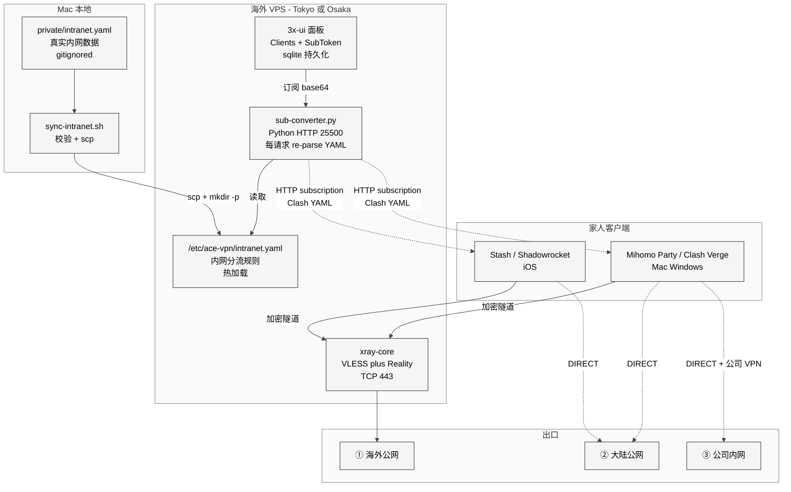
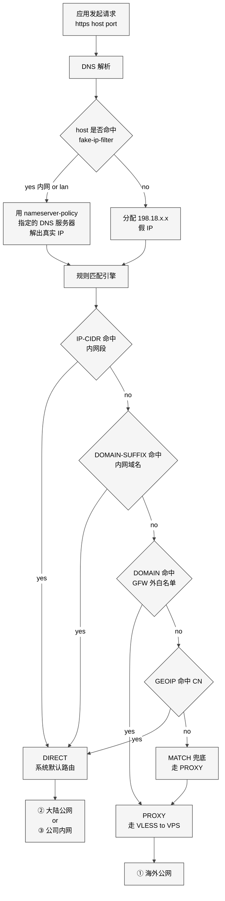
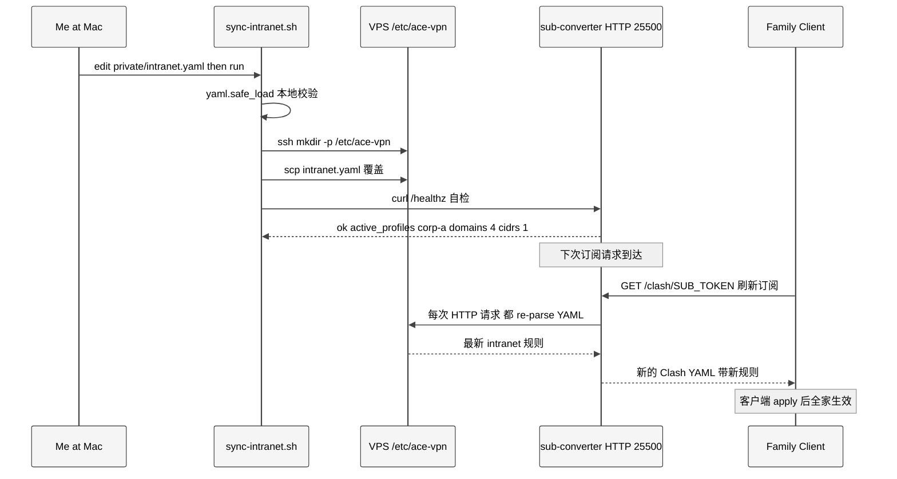

# 家庭自建 VPN 的三网段流量分流架构

> 本文是 [ace-vpn](https://github.com/xiaonancs/ace-vpn) 项目在 2026-04 前后
> 完成深度调优后，把「跨公司内网 / 大陆公网 / 海外公网」三个网段在同一台家
> 用 VPS 上统一分流的完整技术方案。
>
> 受众：打算给自家搭一套 VPN、又希望在公司上班时直接用公司内网，不想天天切
> 来切去的读者。文中所有真实公司名、域名、IP、DNS 均已脱敏，所有示例使用
> `corp-a.example` / `10.x.x.x` 占位。

---

## 目录

1. [问题定义：我到底想解决什么](#1-问题定义我到底想解决什么)
2. [三网段模型](#2-三网段模型)
3. [核心技术挑战](#3-核心技术挑战)
4. [整体架构](#4-整体架构)
5. [分流决策流程](#5-分流决策流程)
6. [DNS 设计（重中之重）](#6-dns-设计重中之重)
7. [规则集与优先级](#7-规则集与优先级)
8. [内网配置的热加载机制](#8-内网配置的热加载机制)
9. [关键踩坑记录](#9-关键踩坑记录)
10. [诊断工具集](#10-诊断工具集)
11. [未来优化方向](#11-未来优化方向)

---

## 1. 问题定义：我到底想解决什么

### 1.1 场景

- 在一线城市工作的技术人，2–5 人家庭共用。
- 每天要用 Claude / ChatGPT / Cursor / YouTube，这些在大陆被墙或被限速。
- 同时在公司上班，公司有自己的内网 VPN（类似 GlobalProtect / 某 Link / 公
  司 Zero Trust 网关），登录后会下发一批 `10.x.x.x` 的内网段和一个内网 DNS。
- 希望**一套客户端同时管这三件事**：访问海外的走代理、访问国内公网的直连、
  访问公司内网的走公司 VPN 出口（DIRECT，让系统路由表 + 公司 VPN 工具自己
  负责）。

### 1.2 反例：不做分流会怎样

| 策略 | 后果 |
|------|------|
| 全部走代理 | B 站 / 淘宝 / 公司内网全炸，延迟翻倍，还容易触发风控 |
| 全部直连 | Claude / YouTube 不通 |
| 按需手动开关代理 | 工作效率杀手，一天切几十次；家人根本不会用 |
| 公司 VPN + 代理软件二选一 | 二者排他，切换时所有长连接断开 |

### 1.3 硬指标

| 维度 | 目标 |
|------|------|
| AI 工具（Claude / ChatGPT） | 100% 海外 IP |
| 大陆公网（B 站 / 抖音 / 淘宝） | 100% 直连，不绕圈 |
| 公司内网（`app.corp-a.example` / `10.x`） | 100% DIRECT，不被代理接管 |
| 切换成本 | 0。同一份订阅，客户端不需动任何设置 |
| 跨公司切换 | 换公司只改一个 YAML 文件，家人端自动同步 |

---

## 2. 三网段模型

把所有流量抽象成三张网：

| 编号 | 名字 | 例子 | 出口策略 |
|:-:|------|------|----------|
| ① | **Net-Overseas**（海外公网） | `claude.ai`, `youtube.com`, `chatgpt.com` | 走 VPS 上的 VLESS+Reality 代理 |
| ② | **Net-CN**（大陆公网） | `taobao.com`, `bilibili.com`, `baidu.com` | 本地直连（不走代理，不走公司 VPN） |
| ③ | **Net-Intranet**（公司内网） | `app.corp-a.example`, `10.0.0.0/8` | DIRECT，交给公司 VPN 工具处理 |

核心设计抉择：**三张网用同一份 Clash YAML 订阅来表达**，客户端只装一个代理
软件、只订一次。

```
     ┌─ ① Net-Overseas ─→ proxy group "Overseas"  → VLESS+Reality to VPS
     │
请求 ├─ ② Net-CN       ─→ proxy group "Direct-CN" → 本机出口（系统默认路由）
     │
     └─ ③ Net-Intranet ─→ proxy group "Direct-LAN" → DIRECT，公司 VPN 接管
```

②③ 同样走 DIRECT，但逻辑分组不同，诊断和统计时一眼看清"这条流量是内网走
的还是大陆公网走的"。

---

## 3. 核心技术挑战

三件事各有各的难：

### 3.1 挑战 A：出境流量如何不被 GFW 阻断

- 普通 V2Ray/Trojan 早被识别，商业 CDN 中转方案不稳定且贵。
- 自签 TLS 证书会被主动探测封端口。

**解决**：VLESS + Reality。Reality 的做法是"偷"一个第三方 HTTPS 站点的 TLS
证书握手，让 GFW 的中间人探测结果和正常访问那个站点完全一致，无法区分代理
和正常流量。代价是要在 VPS 端挑一个稳定、海外热门的"偷用"目标（比如某个
CDN 厂的登录页）。

### 3.2 挑战 B：客户端如何智能识别目的地

问题：客户端（手机/Mac）收到一个 `GET https://xxx/`，怎么知道这是 ①②③ 中的
哪一类？

三种信号源：

1. **域名后缀**：`+.youtube.com` → ①；`+.taobao.com` → ②；`+.corp-a.example` → ③。
2. **IP 段**：`10.0.0.0/8` → ③；`GEOIP,CN` → ②；其余 → ①。
3. **GFW 实测**：某些域名不在常规黑名单但实际被限速，需要手工补进 ①。

Clash 规则引擎同时消费这三种信号（`DOMAIN-SUFFIX`, `IP-CIDR`, `GEOIP`）。

### 3.3 挑战 C：DNS 是最难搞的一环

内网域名 `app.corp-a.example` 被设计成**只有内网 DNS 能解**。但客户端默认
用的是系统 DNS（`8.8.8.8` / `223.5.5.5` / 公司 DHCP 下发的 DNS 混在一起）。
更糟的是：

- 大陆公共 DNS（`223.5.5.5`）对海外域名**有污染**，解出来的 IP 经常是错的。
- 海外公共 DNS（`8.8.8.8`）查国内域名 **CDN 归属不对**，解出来是海外节点，
  拖慢速度。
- 查内网域名，**任何**公共 DNS 都会返回 NXDOMAIN 或错误 A 记录。
- 客户端开 TUN 模式后，**所有 UDP 53 都被 TUN 拦下**，`dig @10.x.x.x` 也没用。

不做 DNS 分层设计，前面两个挑战做得再好都白搭。

### 3.4 挑战 D：客户端软件自己也会捣乱

具体到 Clash Party / Mihomo Party 这个生态：GUI 版本自带 "controlDns" 开
关，**默认开启**，会把订阅里的 `dns:` 段**整段替换**成 GUI 自己的默认配
置——这意味着服务端再怎么精心生成 `fake-ip-filter` / `nameserver-policy`
都会被客户端静默丢弃。

详见 §9.1 踩坑记录。

---

## 4. 整体架构

### 4.1 部件图

一图胜千言：

<div style="background: #ffffff !important; background-color: #ffffff !important; padding: 16px; border-radius: 8px; margin: 16px 0;" bgcolor="#ffffff">



</div>

关键组件：

| 组件 | 角色 |
|------|------|
| **xray-core** | 在 VPS 上终结 Reality 连接、把流量转到海外公网 |
| **3x-ui** | 管理面板；维护 Client（UUID / Flow / Email）和 SubToken，状态全在一个 sqlite |
| **sub-converter.py** | 自研 Python，把 3x-ui 的 base64 `vless://` 订阅转成带分流规则的 Clash Meta YAML |
| **intranet.yaml** | 内网 DIRECT 规则配置文件；Mac 本地 `private/intranet.yaml`（真实数据）→ 一键 scp 到 VPS 的 `/etc/ace-vpn/intranet.yaml`（服务读的副本） |
| **Clash 客户端** | 消费 Clash YAML，负责 DNS + 规则匹配 + 代理出口 |

### 4.2 为什么服务端负责"生成规则"而不是客户端

另一个常见做法是客户端本地维护规则集（一份大文件或 Premium 订阅 + 多
remote rule-provider）。被我们放弃的原因：

1. **规则要能一键下发**：家人的客户端不可能让他们去改 YAML；只有服务端集中
   生成、客户端单一订阅 URL，才能做到"改一次全家生效"。
2. **订阅 URL 本身就是灰度开关**：每个家人一个 SubToken，要"只给老爸一个人
   先切换新规则"也是加一层路由即可。
3. **隐私数据集中**：公司内网域名不能写进客户端规则集（手机万一丢了全泄漏）；
   只写到 VPS 上，客户端拉到什么就用什么，走完就丢。

---

## 5. 分流决策流程

Clash 在处理一个请求时，决策顺序大致如下：

<div style="background: #ffffff !important; background-color: #ffffff !important; padding: 16px; border-radius: 8px; margin: 16px 0;" bgcolor="#ffffff">



</div>

两点需要强调：

**(A)** DNS 是规则匹配的**前置步骤**。Clash 先完成 DNS 解析，再用解析结果
进规则引擎。`IP-CIDR` 匹配要靠真实 IP，如果 DNS 这一步返回的是 fake-IP
（198.18.x.x），`IP-CIDR,10.0.0.0/8` 这类规则就永远不会命中——这是内网场
景里最坑的一个点。

**(B)** 规则顺序很重要。把 `IP-CIDR` 内网规则放最前，是因为某些公司内网域
名同时也在公网有 DNS 记录（"混合域"），只靠 `DOMAIN-SUFFIX` 会误判。走 IP
判断更稳。

---

## 6. DNS 设计（重中之重）

### 6.1 三组 DNS 服务器并存

| 用途 | 上游 | 作用 |
|------|------|------|
| 解海外域名 | `dns.cloudflare.com` / `dns.google`（DoH） | 绕 GFW DNS 污染 |
| 解国内公网域名 | `doh.pub`（腾讯） / `dns.alidns.com`（阿里） | CDN 归属准确 |
| 解公司内网域名 | 公司 VPN 下发的 `10.x.x.x` DNS | 唯一能解内网 |

### 6.2 fake-ip 与 fake-ip-filter

**fake-ip** 是 Clash 的核心机制：收到应用 DNS 查询时，不立即做真实解析，
而是返回一个临时的 `198.18.x.x` 假 IP；等应用实际建 TCP 连接时，Clash 用
最初的 host name 查规则、选代理、再做真实解析（如果需要）。好处：DNS 层
不被污染 + 规则引擎能拿到原始 host。

但 fake-ip 对内网致命：

1. `dig app.corp-a.example` 返回 `198.18.0.42`；
2. 应用 `connect(198.18.0.42:443)`；
3. Clash 看 `198.18.0.42`，但这是假 IP，查 `fake-ip-cache` 反查得到原始 host
   `app.corp-a.example`；
4. 匹配规则命中 `DOMAIN-SUFFIX,app.corp-a.example,DIRECT`；
5. 走 DIRECT，但**Clash 自己不做 DNS**，直接把 `198.18.0.42` 扔给系统 socket；
6. 操作系统对 `198.18.0.42` 没路由，或者路由到 TUN 网卡又环一圈，**连接
   RST**。

解决方案：把内网域名加到 `fake-ip-filter`，Clash 遇到这类 host **跳过 fake-IP**
直接做真实 DNS 解析。

### 6.3 nameserver-policy 指定"谁解哪个域"

把"公司内网域名必须用内网 DNS 解"写到配置里：

```yaml
dns:
  enable: true
  enhanced-mode: fake-ip
  fake-ip-range: 198.18.0.1/16

  fake-ip-filter:
    - "*.lan"
    - "*.local"
    - +.msftconnecttest.com
    - +.app.corp-a.example         # ← 内网域名必须在这
    - +.office.corp-a.example
    - +.corp-a.srv

  nameserver-policy:
    +.app.corp-a.example: [10.x.x.1, 10.x.x.2]   # ← 精确到域用内网 DNS
    +.office.corp-a.example: [10.x.x.1, 10.x.x.2]
    +.corp-a.srv: [10.x.x.1, 10.x.x.2]

  nameserver:
    - https://doh.pub/dns-query
    - https://dns.alidns.com/dns-query

  fallback:
    - https://dns.cloudflare.com/dns-query
    - https://dns.google/dns-query

  fallback-filter:
    geoip: true
    geoip-code: CN
```

### 6.4 为什么必须写具体 DNS IP 而不是 `system`

常见写法：

```yaml
nameserver-policy:
  +.app.corp-a.example: system   # 用系统 DNS
```

这在**没**开 Mihomo TUN 时是 OK 的，TUN 打开后立刻失败。原因：Mihomo Party
/ Clash Party 开 TUN 时会把系统 DNS 改成 `223.5.5.5`（或它自定义的 DoH），
此时"系统 DNS"已经不是公司 VPN 下发的 `10.x.x.x` 了，公司域名必解不出。

写具体 IP → Mihomo 绕过系统 DNS resolver，直接构造 UDP 53 包发到
`10.x.x.1`，成功。

代价：这份 DNS 列表是**动态的**（公司换办公室、换 DNS 就要改），所以必须
做成热加载（§8）。

---

## 7. 规则集与优先级

最终生成的 Clash `rules:` 段大致长这样（从上到下匹配，命中即停）：

```yaml
rules:
  # ─────────── Priority 1: 公司内网 IP 段（任何公司都先内网优先）
  - IP-CIDR,10.0.0.0/8,Direct-LAN,no-resolve
  - IP-CIDR,172.16.0.0/12,Direct-LAN,no-resolve
  - IP-CIDR,192.168.0.0/16,Direct-LAN,no-resolve

  # ─────────── Priority 2: 公司内网域名（多公司并存时按 profile 堆）
  - DOMAIN-SUFFIX,app.corp-a.example,Direct-LAN
  - DOMAIN-SUFFIX,office.corp-a.example,Direct-LAN
  - DOMAIN-SUFFIX,corp-a.srv,Direct-LAN
  # 外包或跨公司场景可以同时开多个 profile
  - DOMAIN-SUFFIX,portal.corp-b.example,Direct-LAN

  # ─────────── Priority 3: 广告 / 追踪黑洞（可选）
  - DOMAIN-KEYWORD,analytics,REJECT
  - DOMAIN-KEYWORD,telemetry,REJECT

  # ─────────── Priority 4: 明确走代理的（GFW 封 or 实测限速）
  - DOMAIN-SUFFIX,claude.ai,Overseas
  - DOMAIN-SUFFIX,openai.com,Overseas
  - DOMAIN-SUFFIX,youtube.com,Overseas
  - DOMAIN-SUFFIX,googlevideo.com,Overseas
  # ... ~200 条 GFW 相关域名 ...

  # ─────────── Priority 5: 明确直连的国内服务
  - DOMAIN-SUFFIX,bilibili.com,Direct-CN
  - DOMAIN-SUFFIX,taobao.com,Direct-CN
  # ... ~100 条常用国内大厂域名 ...

  # ─────────── Priority 6: GeoIP 兜底
  - GEOIP,CN,Direct-CN,no-resolve
  - GEOIP,LAN,Direct-LAN,no-resolve

  # ─────────── Priority 7: 最后兜底 → 走代理
  - MATCH,Overseas
```

要点：

1. **`no-resolve`** 很重要。对 IP-CIDR 规则带上它，告诉 Clash 不要再做反向
   DNS，直接用请求里的 IP 判断。
2. **IP 规则先于域名规则**，因为"混合域"（如同时有公网 CNAME 和内网 CNAME
   的域）只靠域名判断会走错。
3. **MATCH 兜底走代理**，不是走直连——未知流量按"可能是海外服务"处理，防
   止奇怪的第三方 API 用了非常规域名被漏判。

---

## 8. 内网配置的热加载机制

### 8.1 目标：改一次 YAML，全家自动生效

<div style="background: #ffffff !important; background-color: #ffffff !important; padding: 16px; border-radius: 8px; margin: 16px 0;" bgcolor="#ffffff">



</div>

### 8.2 为什么是 per-request parse 而不是 SIGHUP

典型 Linux 服务的惯例是 SIGHUP 触发 reload，但在这里不合适：

| 方案 | 优点 | 缺点 |
|------|------|------|
| SIGHUP reload | 减少每请求开销 | 要手动触发；脚本复杂；出错时难定位 |
| inotify 监听 + 内存缓存 | 零手动触发 | 增加状态；inotify 在某些内核配置下不稳定 |
| **每请求 re-parse**（采用） | 零状态；零触发；改完就生效 | 每请求多 <1ms 解析开销 |

实际每天几十次订阅请求，YAML 体积 < 4KB，解析耗时可忽略。换来的是"爹的电
脑改完立刻生效"的心智简单度。

### 8.3 多公司 profile 设计

YAML 支持多 profile，用 `enabled` 开关：

```yaml
profiles:
  corp-a:
    enabled: true
    desc: "公司 A"
    dns_servers: [10.x.x.1, 10.x.x.2]
    domains: [app.corp-a.example, office.corp-a.example, corp-a.srv]
    cidrs:   [10.0.0.0/8]

  corp-b:
    enabled: false           # 换公司时改成 true，上面那个改 false
    desc: "公司 B"
    dns_servers: [10.y.y.1]
    domains: [portal.corp-b.example]
    cidrs:   [172.20.0.0/16]

  client-x:
    enabled: false           # 外包客户，需要时和 corp-a 并存
    desc: "咨询客户 X"
    domains: [portal.client-x.example]
    cidrs:   [172.30.0.0/16]
```

`sub-converter` 的合并逻辑：所有 `enabled: true` 的 profile **并集**，去重
（保留首次出现顺序）。这样外包场景同时接 A/B 公司内网毫无压力。

---

## 9. 关键踩坑记录

### 9.1 客户端 GUI 偷偷吞掉订阅的 DNS 段

**现象**：服务端生成的 YAML 里 `fake-ip-filter` 和 `nameserver-policy` 明
明对，客户端拉下来的 profile 文件里也对，**但 `dig app.corp-a.example`
仍返回 `198.18.x.x` 假 IP**，而且 `dig @10.x.x.1` 也是假 IP。

**根因**：Clash Party / Mihomo Party 在 macOS 上的配置文件
`~/Library/Application Support/mihomo-party/config.yaml` 默认：

```yaml
controlDns: true            # GUI 接管 DNS 段
useNameserverPolicy: false  # 忽略订阅的 nameserver-policy
```

开着 `controlDns` 时，GUI 把订阅的 `dns:` 段**整块替换**成 GUI 设置页里的
默认值，我们精心塞进去的 `+.app.corp-a.example` 就这样被吃了。

**验证**：对比两份文件是否一致：

```bash
# 订阅原文
grep -A12 "fake-ip-filter" <(curl -s http://$VPS_IP:25500/clash/$SUB_TOKEN)

# mihomo 真正加载的 runtime
grep -A12 "fake-ip-filter" ~/Library/Application\ Support/mihomo-party/work/config.yaml
```

**修复**：

```bash
sed -i '' 's/^controlDns: true$/controlDns: false/' \
  ~/Library/Application\ Support/mihomo-party/config.yaml
sed -i '' 's/^useNameserverPolicy: false$/useNameserverPolicy: true/' \
  ~/Library/Application\ Support/mihomo-party/config.yaml
sudo pkill -9 -f mihomo
# Cmd+Q Clash Party 后重开
```

或 GUI 里：**设置 → DNS → 关掉"控制 DNS"、打开"使用 Nameserver Policy"**。

**教训**：不要假定客户端会"乖乖 apply 你的订阅"。客户端的 GUI 层、核心层
（mihomo binary）、runtime 层三层各有脾气，要逐层 diff 验证。

### 9.2 TUN 模式拦截所有 UDP 53

**现象**：上一条修完后再关 TUN 就正常，开 TUN 仍假 IP。

**根因**：TUN 模式是 L3 虚拟网卡，把**所有**进程的 UDP 53 流量都劫持给
mihomo 内置 DNS 处理，哪怕你写死 `dig @10.x.x.1` 也不会走出物理网卡。

**修复**：接受这个事实，在 YAML 的 `nameserver-policy` 里写死内网 DNS IP，
让 mihomo 内部 DNS 组件直接构造 UDP 包发出去（mihomo 会区分"自己发的"和
"应用发的"，前者会正常走物理网卡）。

### 9.3 fake-ip 缓存持久化

**现象**：修完 `fake-ip-filter` 重启 mihomo，某个内网域名**还是**返回 fake-IP。

**根因**：fake-ip cache 落盘在 `~/Library/Application
Support/mihomo-party/work/cache.db`，mihomo 启动时直接 reload。

**修复**：

```bash
rm ~/Library/Application\ Support/mihomo-party/work/cache.db
sudo dscacheutil -flushcache
sudo killall -HUP mDNSResponder
# Cmd+Q 重开 Mihomo
```

### 9.4 GeoIP 数据库过期

**现象**：`GEOIP,CN,Direct-CN` 把某些国内 IP 判成海外，走了代理导致慢。

**根因**：mihomo 内置的 `Country.mmdb` 很久没更新，新分配给中国的 IP 段没
被收录。

**修复**：在订阅 YAML 里加：

```yaml
geodata-mode: true
geox-url:
  mmdb: "https://github.com/Loyalsoldier/geoip/releases/latest/download/Country.mmdb"
```

客户端每次启动拉最新库。

### 9.5 `hosts:` 写死导致规则失效

**现象**：为了加速把 `claude.ai: 1.2.3.4` 写进 YAML 的 `hosts:` 段，结果
`claude.ai` 不再走代理。

**根因**：`hosts:` 在 DNS 之前生效，返回真实 IP 后，`DOMAIN-SUFFIX,claude.ai`
规则不再匹配（它匹配的是 host，但应用拿到 IP 直接建连，Clash 只能靠反查，
一些客户端反查会跳）。

**修复**：不用 `hosts:` 做加速，改用 mihomo 的 `rule-providers` 或直接让
代理节点选好 CDN。

---

## 10. 诊断工具集

三个必备工具：

### 10.1 服务端 `/match` 接口

`sub-converter` 暴露的调试端点，返回某个 URL 命中的规则：

```bash
$ curl -s "http://$VPS_IP:25500/match?url=https://portal.corp-a.example/" \
  | python3 -m json.tool
{
  "input": "https://portal.corp-a.example/",
  "host": "portal.corp-a.example",
  "resolved_ip": null,
  "rule_index": 4,
  "rule": "DOMAIN-SUFFIX,app.corp-a.example,Direct-LAN",
  "target": "Direct-LAN",
  "active_profiles": ["corp-a"]
}
```

权威性：`/match` 用 `build_rules()` 本身跑一遍，和生成订阅走同一条代码路
径。**服务端说命中哪条，客户端拿到的就命中哪条**（除非客户端缓存或 GUI
override）。

### 10.2 Mac 端 `test-route.sh`

包装脚本，一次打三套诊断：

```bash
$ bash scripts/test-route.sh https://portal.corp-a.example/
[1/3] 服务端权威决策 ......... Rule: DOMAIN-SUFFIX,...,Direct-LAN
[2/3] 本地系统 DNS 解析 ...... 10.0.0.42 ✓（不是 198.18.x.x）
[3/3] 通过本机 Clash 代理请求  HTTP 200, 总耗时 123ms, 出口 IP=10.0.0.42
```

任何一步异常立刻定位问题层：
- [1] 不对 → 规则或 intranet.yaml 没同步
- [2] 是 `198.18.x.x` → fake-ip-filter 没生效（大概率 §9.1）
- [3] 超时 → 公司 VPN 没连，或内网 DNS 没通

### 10.3 三层 diff

怀疑 GUI override 时：

```bash
diff <(curl -s http://$VPS_IP:25500/clash/$SUB_TOKEN | grep -A30 "^dns:") \
     <(grep -A30 "^dns:" ~/Library/Application\ Support/mihomo-party/work/config.yaml)
```

两份应完全一致，有差异就是客户端吃掉了。

---

## 11. 未来优化方向

### 11.1 IPv6 分流

目前 `GEOIP,CN` 只管 v4，v6 兜底走代理。`GEOIP6,CN` 在 mihomo 最新版已支
持，还没加上。

### 11.2 按应用识别

mihomo 支持 `PROCESS-NAME` 规则，可以实现"Cursor 永远走 Overseas，微信永
远 Direct-CN"。当前规则集没用，因为家人客户端上很难统一进程名（尤其
Windows）。

### 11.3 节点智能调度

现在家人端统一拿到"最低延迟节点"，但 Reality 握手的延迟波动很大。下一步
打算在 `sub-converter` 里根据 User-Agent 给手机端和桌面端不同的节点排序
（手机优先 CN2 GIA 路由，桌面优先带宽大的日本直连）。

### 11.4 告警

VPS 被封或带宽打满时，家人会最先察觉但说不清楚。计划加：

- VPS 上起个 `blackbox-exporter` 定时探测几个海外锚点（YouTube / OpenAI）；
- 失败率 > 20% 时 Telegram bot 告警给自己；
- 家人端订阅 URL 后面带 `?v=`，改完推一次就全家同步。

### 11.5 移动网络下的 DNS

手机 4G/5G 下公司 VPN 不保证自动连上，此时内网域名注定解不出。当前方案是
"手机进公司 WiFi 才能访问内网"，足够用。更极致的做法是把公司 VPN 的
WireGuard 配置也塞到 Clash 里作为二级出口，但要看公司 Security 是否允许。

---

## 参考资料

- 项目源码：<https://github.com/xiaonancs/ace-vpn>
- 服务端脚本：`scripts/sub-converter.py`、`scripts/sync-intranet.sh`、`scripts/test-route.sh`
- 完整开发文档（含部署/迁移/运维）：[`docs/dev-skill.md`](./dev-skill.md)
- Oracle Cloud 免费 VPS 申请：[`docs/Oracle Cloud 注册教程.md`](./Oracle%20Cloud%20注册教程.md)
- [Clash Meta 官方文档 · DNS 配置](https://wiki.metacubex.one/config/dns/)
- [Mihomo · fake-ip 机制说明](https://wiki.metacubex.one/config/dns/fake-ip/)
- [Xray Reality 协议设计](https://github.com/XTLS/Xray-core/discussions/1295)
